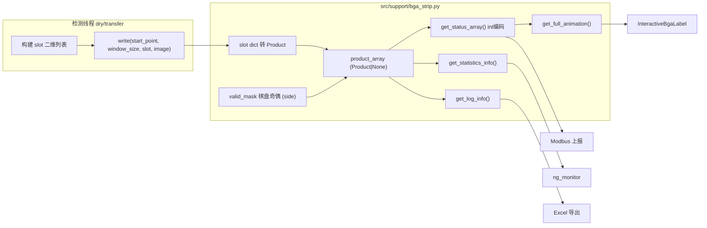

# refactor: Bga_Strip 独立模块化与数据结构适配

## 问题框架

`Bga_Strip` 类（[src/support/support_funs.py](src/support/support_funs.py) L617-1201）目前维护三套并行存储：

- `full_value`：int 编码棋盘数组（0=空白格 / 99=未检 / 1-8=缺陷色码 / 2=OK）
- `image_dict`：`(row_start, col_start)` → 整帧图像
- `accumulated_log_info`：日志 dict 列表（统计与导出的数据源）

`write(slot, current_image)` 由内部 `position_list[count]` 蛇形游标决定写入位置，调用方无法控制；[src/support/data_structure.py](src/support/data_structure.py) 已定义 `Product` 及各检测结果 dataclass，但未被运行代码使用。

## 关键决策（已与用户确认）

1. `Bga_Strip` 合并为一个带方法的类，落于新模块 `src/support/bga_strip.py`；`data_structure.py` 中的 `Bga_Strip` dataclass 草案删除
2. `product_array`（`strip_rows × strip_cols` 的 object ndarray，元素为 `Product | None`）作为单一数据源；日志/统计/动画/状态码全部按需推导
3. **交替棋盘格算法保留在类内部**，由 `strip_side`（front/back）决定合法格奇偶性（`create_alternating_array` 逻辑保留为内部 valid_mask）
4. **调用方一并修改，不保留兼容层**

## 架构

## 实施单元

### U1. 新建 `src/support/bga_strip.py` 与 Product 转换层

- 类持有：`station`、`strip_side`、`strip_lot/sn/create_time`、`strip_rows/cols`、`window_rows/cols`、`params`、`product_array`、`image_dict`、内部 `valid_mask`（由 `create_alternating_array` 按 side 起始奇偶生成，类内部维护）
- `position_list`（蛇形写入位置序列，`calculate_write_positions` 生成）保留为类属性——`InteractiveBgaLabel` pos 模式与线程游标仍依赖
- 编写 `slot dict → Product` 转换：线程 slot 中 `product_info` 的 `size_result/mark_result/ball_result/shift_result/scratch_result` 为 `(ok, msg, data)` 元组结构（见 write 现实现 L775-834），映射到 `Size_Result/Mark_Result/...` dataclass；`defect_type` 优先级 → `animation_color`（沿用现行 1-8 色码映射）；未检出格生成 `defect_type=["Empty"]` 的占位 Product（替代 `_vacant_log_entry`）
- `data_structure.py`：删除 `Bga_Strip` dataclass，保留 `Product`、`LogInfo` 等类型定义

### U2. write 改造为「起始点 + 窗口大小」

- 新签名：`write(start_point, window_size, slot, current_image)`，`start_point=(row, col)`、`window_size=(rows, cols)`
- 行为：边界裁剪 → 在窗口内只对 valid_mask 合法且尚未写入的格赋值 → slot 有结果转 Product 写入，slot 为 None 的合法格写 Empty 占位 → `image_dict[start_point] = current_image`（保留超限裁剪）
- 维度/类型校验沿用现有防御逻辑（`_is_bga_product_slot` 等），异常帧记 Empty
- 删除内部 `count` 自增驱动（位置由调用方决定）

### U3. 推导函数适配与简化

- `get_status_array()`：从 `product_array` + `valid_mask` 推导 int 编码数组（0/99/1-8 编码保持不变——Modbus 上报与动画依赖），替代外部直接读 `full_value`
- `get_full_animation()`：基于 `get_status_array()`，颜色映射不变
- `get_log_info()` / `get_statistics_info()`：遍历 `product_array`（按蛇形写入序保持 product_index 一致性），返回结构保持与 `data_structure.py` 的 `LogInfo` / `StatisticsInfo` 完全一致（ng_monitor、Excel 导出依赖）
- `get_pos_image(pos)` 保留；删除无调用方的 `cleanup_old_data` 和死代码

### U4. 调用方迁移（无兼容层）

- [src/threads/dry_thread.py](src/threads/dry_thread.py)（L27、366、376 构造；L476 write；L285 `.full_value.copy()`）与 [src/threads/transfer_thread.py](src/threads/transfer_thread.py)（对称位置）：线程维护蛇形游标（从 `bga_strip.position_list` 取当前 start_point 与窗口尺寸传给 write）；`.full_value.copy()` → `get_status_array()`
- [main_window.py](main_window.py)：import 路径更新；`.side`、`get_pos_image`、`get_full_animation` 调用点适配
- [src/support/InteractiveBgaLabel.py](src/support/InteractiveBgaLabel.py)：`.full_value.shape` / `.full_value[r,c]` → `get_status_array()`；`.position_list` 保留访问
- [src/threads/thread_imports.py](src/threads/thread_imports.py)、`src/threads/suckerthread_*.py` 注释：import 来源更新
- `support_funs.py`：删除 Bga_Strip 类及仅其专用的私有函数（`_vacant_log_entry` 等迁入新模块或删除）

### U5. 验证

- 仓库无测试框架：以 `python -c` 导入冒烟 + 构造 `Bga_Strip` 实例模拟两帧 write（front/back 各一）验证 status_array 棋盘奇偶、Empty 计数、log_info/statistics_info 字段完整性
- 全仓库 grep 确认无残留 `full_value` / 旧 write 签名 / 旧 import 引用

## 范围边界

- 不改动检测算法（`execute_product_detection`）、UI 显示逻辑、Excel/日志导出格式
- 不改变 `get_log_info` / `get_statistics_info` 返回结构（下游 ng_monitor、log_utils 依赖）
- Modbus 上报的 int 编码协议保持不变

## 风险

- slot dict 元组结构 `(ok, msg, data)` 在两线程中字段不完全一致（dry 为检测、transfer 为模板匹配填充）——转换层需以实际 write 现实现的取值路径为准
- `product_index` 顺序：现按写入序累积；改为从 product_array 推导时需按蛇形位置序重建，保证 Excel 行序不变
