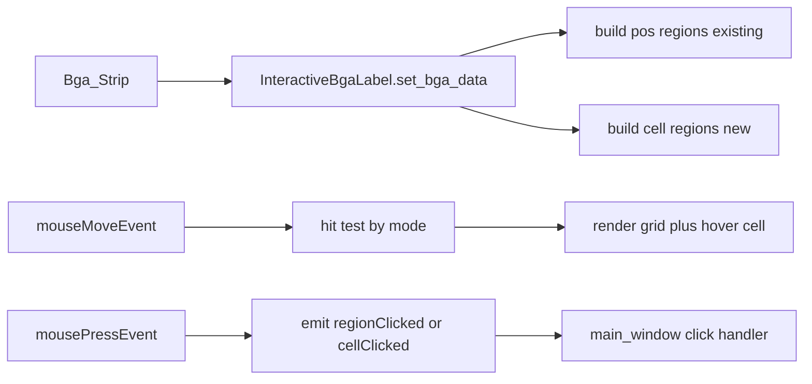

# 为 InteractiveBgaLabel 增加 cells 交互模式（仅动画侧）

## 目标与范围

- 目标：让 [`src/support/InteractiveBgaLabel.py`](src/support/InteractiveBgaLabel.py) 支持 `cells` 交互模式，行为对齐 [`tests/search_roi_test.py`](tests/search_roi_test.py) 的 animation 侧交互：
  - 悬停：仅当前 cell 紫色高亮
  - 背景网格：显示全体浅灰网格边界
  - 点击：输出/回传 cell 级别信息（至少包含 grid row/col，建议含 mask 值）
  - 点击：主界面显示该 cell 对应原图 ROI 的裁剪画面（与测试脚本 `cell_crop` 语义一致）
- 范围边界：
  - 保持现有 ROI 框选链路不变（不迁移 `select_roi_grid` 到 Qt）
  - 保持当前 `pos` 模式可用（向后兼容）

---

## 现状约束（基于代码）

- [`src/support/InteractiveBgaLabel.py`](src/support/InteractiveBgaLabel.py) 目前通过 `_calculate_regions()` 基于 `position_list` 构建“窗口级 region”，并在 `mouseMoveEvent`/`mousePressEvent` 中命中后触发 `regionClicked`。
- [`src/support/support_funs.py`](src/support/support_funs.py) 的 `Bga_Strip.get_full_animation()` 定义了动画网格的像素公式（`margin=2`, `480//rows`, `150//cols`），tests 里的 `build_animation_cell_rects` 与其一致。
- [`main_window.py`](main_window.py) 中 `_replace_mapping_label -> regionClicked -> on_bga_region_clicked` 目前按 `get_pos_image(pos_start)` 显示窗口图，不具备 cell 级 payload 消费。

---

## 技术方案概览

- 在 `InteractiveBgaLabel` 引入显式交互模式：`pos`（默认）与 `cells`。
- 将“网格像素计算”抽到可复用 helper（避免 `InteractiveBgaLabel` 与 `Bga_Strip.get_full_animation` 公式漂移）。
- 新增 cell 级事件输出（建议新增信号 `cellClicked(dict)`，保留 `regionClicked(tuple)`）。
- `main_window` 增加对 cell payload 的分支处理，先保证 UI 可用（日志/状态显示 + 可选图像展示），再保持旧路径兼容。

---

## Implementation Units

- U1. **抽象交互模式与网格几何计算**

**Goal:** 在 label 内建立 `pos/cells` 双模式基础，避免硬编码分散。

**Requirements:**
- R1. 现有 pos 模式行为不回归
- R2. cells 模式的网格坐标与 animation 一致

**Dependencies:** None

**Files:**
- Modify: [`src/support/InteractiveBgaLabel.py`](src/support/InteractiveBgaLabel.py)
- Modify: [`src/support/support_funs.py`](src/support/support_funs.py)
- Test: [`tests/test_interactive_bga_label_cells_mode.py`](tests/test_interactive_bga_label_cells_mode.py)

**Approach:**
- 在 `InteractiveBgaLabel` 增加 `interaction_mode` 与 `set_interaction_mode(mode)`。
- 新增 `_calculate_cells_regions()`（按 full grid 逐格建索引）与统一 hit-test 入口（按 mode 切换）。
- 在 `support_funs.py` 增加网格像素参数 helper（例如返回 `margin/block_h/block_w`），`InteractiveBgaLabel` 与 `get_full_animation` 共用。

**Patterns to follow:**
- 复用 `_label_to_image_coords()` 当前缩放映射逻辑。
- 维持 `_get_display_info()` + `paintEvent` 的比例显示路径。

**Test scenarios:**
- Happy path: `cells` 模式下，给定 `(rows, cols)` 可生成 `rows*cols` 个 cell region。
- Edge case: 非整除尺寸下（如 20x4）首尾 cell 边界与 helper 公式一致。
- Error path: mode 非法值时回退默认 `pos` 或抛出受控异常（按项目现有风格）。

**Verification:**
- `pos` 模式老功能不变；`cells` 模式具备稳定几何基础。

---

- U2. **实现 cells 悬停叠加渲染（网格+当前高亮）**

**Goal:** 复刻测试脚本 animation 交互视觉语义到 Qt Label。

**Requirements:**
- R3. 全网格可见（浅灰边）
- R4. 当前 hover cell 紫色高亮且单一

**Dependencies:** U1

**Files:**
- Modify: [`src/support/InteractiveBgaLabel.py`](src/support/InteractiveBgaLabel.py)
- Test: [`tests/test_interactive_bga_label_cells_mode.py`](tests/test_interactive_bga_label_cells_mode.py)

**Approach:**
- 在 `_create_image_with_region` 基础上扩展为 mode-aware overlay：
  - `pos` 模式保持当前行为
  - `cells` 模式先画全网格浅灰，再画 hover cell 紫框
- `mouseMoveEvent` 在 `cells` 模式使用 cell hit-test 更新 hover 索引。

**Patterns to follow:**
- 沿用当前 OpenCV 绘制 + QPixmap 转换管线。

**Test scenarios:**
- Happy path: 鼠标移动到某 cell 后仅该 cell 高亮。
- Edge case: 鼠标离开 label 后 hover 清空并恢复底图。
- Integration: resize 后命中与视觉高亮仍对齐（坐标映射不偏移）。

**Verification:**
- 与 `tests/search_roi_test.py` 的 animation 侧悬停行为一致。

---

- U3. **新增 cell 点击 payload 与主窗口消费链路**

**Goal:** 点击 cell 时能把 cell 级信息传到主窗口，而不破坏旧 `regionClicked` 逻辑。

**Requirements:**
- R5. cells 点击可回传 `grid_row/grid_col`（建议附 `mask_value`）
- R6. 现有 `regionClicked -> on_bga_region_clicked` 兼容保留
- R7. cells 点击后可显示对应 `cell_roi` 的原图裁剪图

**Dependencies:** U1, U2

**Files:**
- Modify: [`src/support/InteractiveBgaLabel.py`](src/support/InteractiveBgaLabel.py)
- Modify: [`main_window.py`](main_window.py)
- Modify: [`src/support/support_funs.py`](src/support/support_funs.py)
- Test: [`tests/test_interactive_bga_label_cells_mode.py`](tests/test_interactive_bga_label_cells_mode.py)

**Approach:**
- 在 `InteractiveBgaLabel` 新增 `cellClicked` 信号（dict payload），保留 `regionClicked`。
- payload 最小字段：`grid_row_0`, `grid_col_0`, `mask_value`；新增 `cell_roi`（原图坐标）用于裁剪显示。
- `main_window._replace_mapping_label` 增加新信号连接；新增 `on_bga_cell_clicked(payload, work_position)`。
- 主窗口在 `on_bga_cell_clicked` 中按 `cell_roi` 从当前原图裁剪并显示到对应预览控件（如 `label_current_cam_live_*`），并保持 `on_bga_region_clicked` 原逻辑。

**Patterns to follow:**
- 参考 `on_bga_region_clicked` 的异常保护与图像类型规范化流程。

**Test scenarios:**
- Happy path: 点击有效 cell，主窗口收到完整 payload。
- Happy path: 点击有效 cell，主窗口显示该 cell 对应原图裁剪画面。
- Error path: 点击空白区域不触发 payload。
- Error path: `cell_roi` 越界或空裁剪时给出可见提示，且不导致界面异常。
- Integration: dry/transfer 两个 work_position 的连接都生效。

**Verification:**
- 在 cells 模式点击任意网格，主窗口可区分并处理 cell 级事件，并显示对应原图裁剪画面。

---

- U4. **补充回归与手工验证脚本用例**

**Goal:** 保证新旧两种交互模式都可稳定使用。

**Requirements:**
- R8. pos 模式回归通过
- R9. cells 模式交互与测试脚本预期一致（含点击裁剪显示）

**Dependencies:** U3

**Files:**
- Modify: [`tests/search_roi_test.py`](tests/search_roi_test.py)
- Create/Modify: [`tests/test_interactive_bga_label_cells_mode.py`](tests/test_interactive_bga_label_cells_mode.py)

**Approach:**
- 增加最小自动化测试（几何计算、mode 切换、payload 结构）。
- 在现有 `search_roi_test.py` 中补充“Qt label cells 模式人工验收步骤说明”（不改变其 ROI 框选主目标）。

**Test scenarios:**
- Happy path: cells 悬停、点击、payload 输出流程完整。
- Edge case: 首行首列、末行末列 cell 命中正确。
- Regression: pos 模式点击仍能驱动 `get_pos_image` 显示链路。

**Verification:**
- 自动化检查通过，且人工演示路径在 dry/transfer 均可复现。

---

## 风险与缓解

- 网格公式漂移风险：统一 helper 并在测试中比对 cell rect。
- 信号语义冲突风险：新增 `cellClicked` 而非改写 `regionClicked`，逐步迁移消费侧。
- 高频 mouse move 性能风险：保留“仅在命中变化时重绘”的策略，必要时再做 paint 层优化。

---

## 交付顺序建议

1. 先落 U1（结构与几何统一）
2. 再落 U2（可见交互）
3. 接入 U3（主窗回调）
4. 最后 U4（回归与验收文档）

该顺序能最小化回归风险，并保证每步都可独立验证。